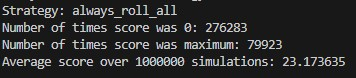
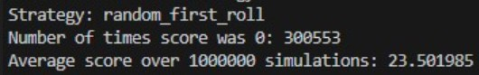
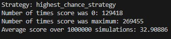
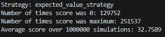

# Yahtzee

## What is Yahtzee
For those who don't know Yahtzee is a dice game that involves both luck and strategy. The game is played with 5 dices and a scoreboard and the goal is to score the most points given the outcomes from the scoreboard. A round of Yahtzee works like this:
- Roll the dices so you get a starting combination
- Make actions (you can choose which dice to keep and which to roll)
- Roll the dices that are not kept
- Make actions
- Roll dices
- Check if your combination scored points
- End of Round

## The Goal
My goal ? Simple. Create an intelligent agent that can play the game of Yahtzee optimally

## The approach
For starters I reduced the game to just two rounds and two outcomes : Full House (FH) and Small Straight (SS). In the Yahtzee game you have 
- Full House: 25 points provided that one has three-of-a-kind and the other two dice are a pair;
- Small Straight: 30 points provided four of the dice have consecutive values;  

My idea for a strategy, quite a simple one actutally, is to always check the highest chance to score points, or in other words to always check before taking actions which scenario is more probable, hitting a FH or hitting a SS. For that I needed to know for each combination of dices what are the chances to hit either FH or SS. So I made an algorithm using expectiMax to determine for each of the two outcomes and for the number of actions left and for each of the 252 unique combinations of dices the chances to hit and stored them in a table.

## The results
I needed to set a baseline so I try the worst strategy I thought of and that is to always roll, make no actions. This strategy got surprisingly, for me at least, an average of aproximately 20 point out of a total of 55 when I run the game for 1 million times  
   

I tried another bad strategy, to check the highest chance to hit one of the outcomes just before making the last actions. This stategy was a somewhat better than the other one and got aproximately 23 points when the game was simulated 1 million times  
   

The time for trying my strategy has come. Knowing the chances to hit one of the outcomes at all times seems to be quite usefull. My strategy got a average score of aproximately 33 points out of the total 55 when I played the game 1 million times  
   

Another good strategy was to check the expected value (chance * score) instead of only the chances. This one was a bit worse the my strategy scoring a average of 32.7 when simulated 1 million times  
   
